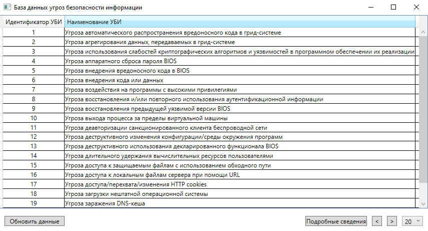
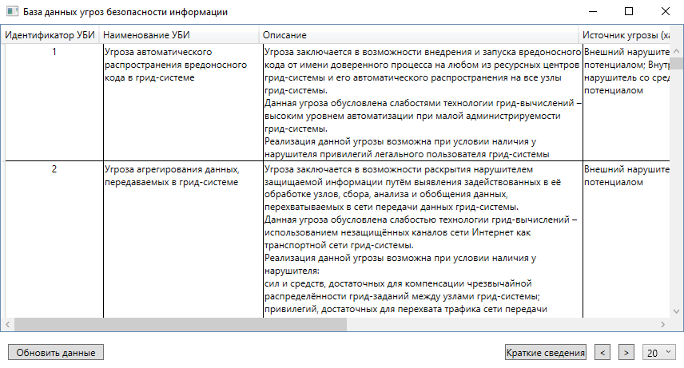
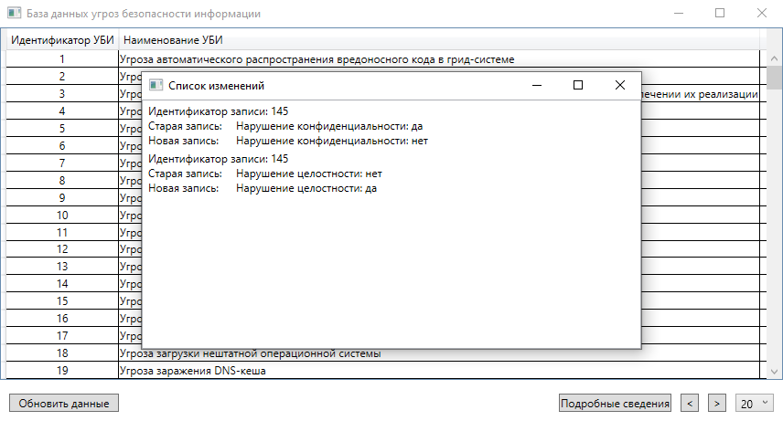

# Threat Parser

The application automatically creates a local database of information threats by downloading and then parsing information from the official threat database of the FSTEC of Russia.

## Features
### Viewing the general list of threats

Displays short information about threats in the form of a threat ID and name.

 

### View all details about each threat

Each information security threat record includes the following information:

-   identifier
-   name
-   description
-   source
-   object of influence
-   privacy violation (yes/no)
-   violation of integrity (yes / no)
-   accessibility violation (yes/no)

 

### Update information

Automatic updating of information (at the request of the user), as a result of which the program displays a report on updated records.

 

## Technologies
-   .NET Fraemwork 4.7.2
-   WPF
-   C#
-   EPPlus library version 6.0

