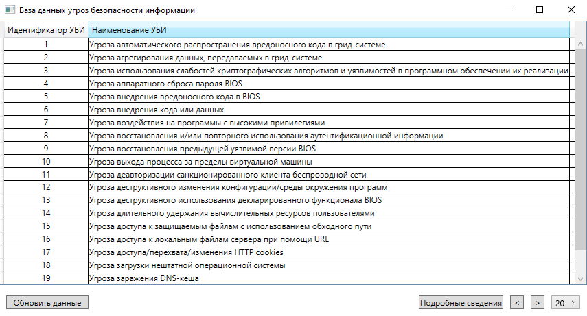
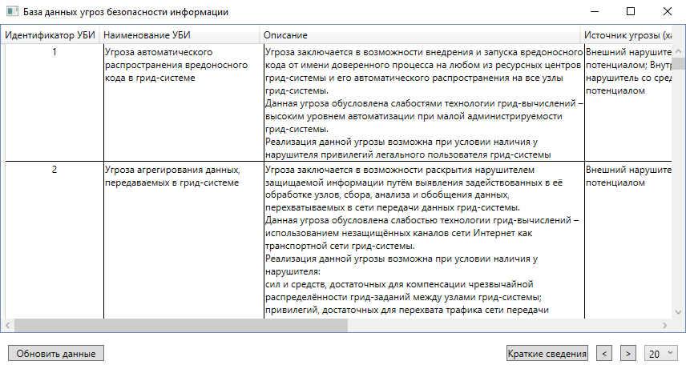

# Парсер угроз

Приложение автоматически создает локальную базу данных угроз информации, путем загрузки и последущего парсинга информации из официального банка данных угроз ФСТЭК России. 

## Просмотр общего перечня угроз

Выводит краткую информацию об угрозах в виде идентификатора угрозы и наименования.

 

## Просмотр всех сведений о каждой угрозе

Каждая запись об угрозе безопасности информации включает в себя следущие сведения:

- идентификатор
- наименование
- описание
- источник
- объект воздействия
- нарушение конфиденциальности (да/нет)
- нарушение целостности (да/нет)
- нарушение доступности (да/нет)

 

## Обновление сведений

Автоматическое обновление сведений (по запросу пользователя) в результате чего программа выводит отчет об обновленных записях.

 

